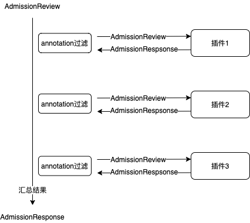

# bcs-webhook-server插件接口改造方案

## 背景

在容器集群中，许多功能都需要基于apiserver的Webhook实现，如日志采集信息注入，DB授权容器注入，镜像预加载等。  
通常来说，每种组件都需要实现和管理各自的webhook server，管理和部署较为繁杂。为了简化各模块webhook功能的实现，减少管理和部署的复杂程度，  
我们采用bcs-webhook-server实现多种webhook功能。bcs-webhook-server将提供统一的webhook插件接口，并通过配置参数选择需要激活的webhook插件。

## 方案设计

### 主要思想



* 如何判断是否调用插件
  * 方式1: 插件注册无须向bcs-webhook-server注册Object类型，bcs-webhook-server判断AdmissionReview中Request.Object的Annotation，根据annotation分发到对应的插件
  * 方式2: 插件向bcs-webhook-server注册需要关注的Object类型，bcs-webhook-server根据GroupVersionKind将请求分发到对应的插件
  * 最后选择方式1，原因是方式1插件注册简单，插件开发更加灵活一些

* 链式调用
  * 根据bcs-webhook-server启动参数指定激活的插件列表，和插件调用的顺序
  * 根据对象annotation决定是否调用插件
  * 汇总插件调用结果，解码Patch信息，合并patch信息
  * 汇总插件调用结果，如果有其中一个插件调用返回Allowed为false，或者返回失败，则返回Allowed为false

### 接口设计

#### 插件接口

```golang
type Plugin interface {
    // AnnotationKey 用户获取webhook插件关注的runtime Object的annotation key
    AnnotationKey() string
    // Init 插件初始化函数，bcs-webhook-server给插件传输配置文件
    Init(configFilePath string) error
    // Handle 插件真正进行hook功能的函数
    Handle(v1beta1.AdmissionReview) *v1betav1.AdmissionResponse
    // Close 插件退出函数，bcs-webhook-server退出时调用
    Close() error
}
```

#### 插件示例

* bcs-webhook-server提供全局函数pluginmanager.Register，新插件需要在init函数中调用方法进行插件注册

```golang
package example

func init() {
    var p := &TestPlugin{}
    pluginmanager.Register("test", p)
}

type TestPlugin struct {}

func (tp *TestPlugin) AnnotationKey() string {
    return "example.bkbcs.tencent.com"
}

func (tp *TestPlugin) Init(configFilePath string) error {
    return nil
}

func (tp *TestPlugin) Handle(v1beta1.AdmissionReview) *v1betav1.AdmissionResponse {
    return nil
}

func (tp *TestPlugin) Close() error {
    return nil
}

```

### 规范

#### annotation命名规范

格式

{功能模块名称}.webhook.bkbcs.tencent.com  

#### 配置加载

* bcs-webhook-server配置参数中提供pluginConfDir来指定所有插件的配置文件所在文件夹
* 插件配置文件为“{插件名字}.conf”
* bcs-webhook-server收集对应插件路径，传输给各个插件
